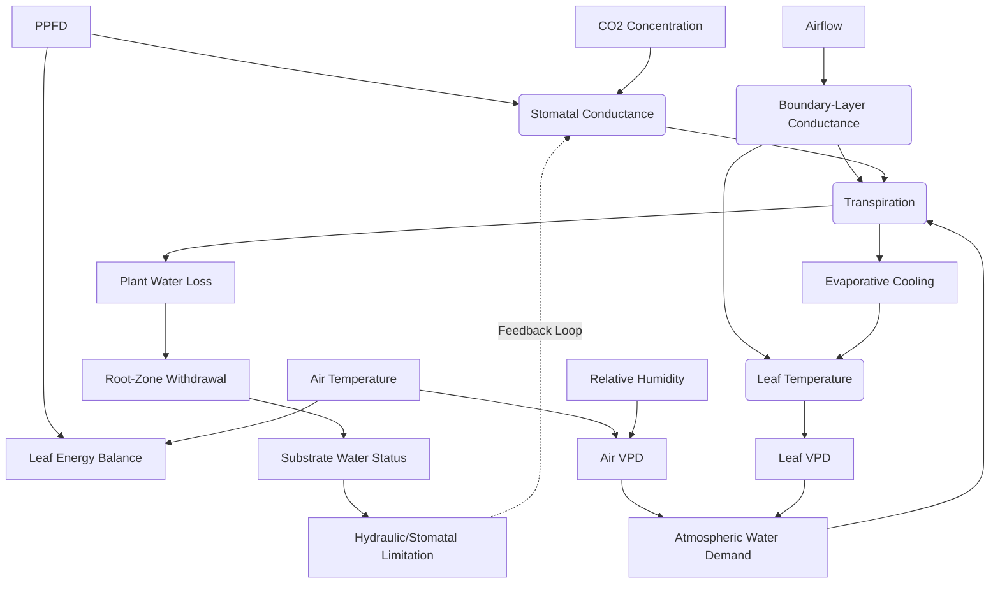

# P1B Model Selection: Architecture and Design

## B4. Model Architecture Recommendation

**Recommended Architecture: Hybrid Mechanistic/Empirical**

A fully mechanistic model (e.g., iterative energy balance + Farquhar photosynthesis + Medlyn stomatal conductance + root hydraulic limitation) is scientifically defensible but observationally demanding. It requires numerous cultivar-specific parameters (Vcmax, Jmax, g1, vulnerability curves) that are currently lacking for most commercial cannabis strains. Additionally, iterating an energy balance equation per plant at every timestep poses severe performance risks for mobile operation.

Conversely, a simple empirical regression (e.g., Transpiration = f(VPD, PPFD)) lacks the causal mechanisms to simulate CO2 enrichment benefits or substrate drying stress realistically, making it inadequate for a core simulation loop.

Therefore, a **Hybrid Mechanistic/Empirical** approach is recommended:
1.  **Stomatal Conductance:** Use a simplified Medlyn or Ball-Berry derivative, parameterized with generalized cannabis coefficients where available, scaling with PPFD, VPD, and CO2.
2.  **Transpiration:** Driven mechanistically by vapor pressure deficit (VPD) and the derived stomatal/boundary-layer conductance (Penman-Monteith framework simplified for indoor environments).
3.  **Leaf Temperature:** For early tiers, rely on measured or configured offsets (e.g., $T_{leaf} = T_{air} - 2^\circ C$ under high transpiration, or derived from empirical PPFD heating) rather than a full iterative energy balance.
4.  **Root-zone:** Modeled as a simple mass-balance bucket (as supported by recent Powell & Bauerle research) rather than full soil hydraulic physics. Substrate water limitation directly scales down maximum stomatal conductance empirically.

This approach provides causal feedback loops (e.g., VPD drives transpiration, drying substrate reduces stomatal conductance) without requiring uncalibrated mechanistic complexity.

## B5. Fidelity Tiers

Internal simulation fidelity tiers are architecturally highly useful for P1B. They allow the simulation to gracefully degrade when environmental data or compute is limited.

*   **Tier 0:** Known environmental values supplied directly. (Current P1A). Leaf temperature is explicit or null.
*   **Tier 1:** Leaf-scale water relations. Transpiration is calculated from explicit air conditions, fixed boundary layer, and simplified stomatal response.
*   **Tier 2:** Canopy aggregation. Boundary layer responds to canopy density and room airflow.
*   **Tier 3:** Root-zone coupling. Transpiration removes substrate water; low substrate water limits stomatal conductance.

## B6. State-Variable Proposal

The minimum future state necessary for P1B (not implemented yet):

**Environmental State**
*   **air_velocity (m/s):** Needed to estimate boundary-layer conductance. Observable via room fans.

**Leaf State**
*   **stomatal_conductance (mol m⁻² s⁻¹):** Mechanistic driver of water loss and CO2 uptake. Observable via porometry.
*   **boundary_layer_conductance (mol m⁻² s⁻¹):** Dictates resistance to heat and mass transfer. Difficult to observe directly in-situ.
*   **transpiration_rate (mmol m⁻² s⁻¹):** The primary water loss flux. Observable via lysimetry/weighing scales.

**Whole-Plant State**
*   **canopy_area (m²):** Scales leaf-level fluxes to the whole plant. Observable via overhead imaging.
*   **cumulative_water_use (L):** Tracks total mass balance. Observable via total irrigation/runoff.

**Root-Zone State**
*   **substrate_water_content (vol/vol):** Drives water limitation. Observable via TDR/capacitance sensors.
*   **available_water (L):** The integration of water content and container volume.

## B7. Coupling Diagram

A directed dependency graph identifying feedback loops for P1B:

## B8. Calibration Strategy

Calibration should be structured hierarchically to handle the lack of ubiquitous cultivar data:
1.  **Physical constants:** (e.g., psychrometric constant, latent heat). Hardcoded.
2.  **Species-level parameters:** Baseline stomatal sensitivity to VPD and CO2. Calibrated against generalized hemp/cannabis literature.
3.  **Cultivar parameters:** Specific stomatal density, drought plasticity. Initially set to species defaults, exposed for future user tweaking or specific profile generation.
4.  **Substrate parameters:** Field capacity and wilting point mapped to generic media types (Rockwool, Coco Coir, Soil).
5.  **Gameplay/time-compression:** A separate multiplier applied *after* physical flux calculations to handle arbitrary gameplay speeds without breaking physics.

**Benchmark Scenarios:**
*   **High VPD Stress:** Tests stomatal closure at > 1.6 kPa.
*   **Drought Depletion:** Validates mass-balance dry down and subsequent limitation.
*   **CO2 Enrichment:** Ensures transpiration decreases and WUE increases under 1000+ ppm CO2.

## B10. Performance Analysis

*   **10 plants:** Negligible impact. Any model runs fine.
*   **100 plants:** Iterative energy balance models begin to show measurable overhead if run every frame.
*   **1,000 plants:** Per-plant mechanistic iterations are unviable for mobile without significant time-slicing or approximations.

**Optimization Strategy:**
*   **Per environmental cell:** Air temperature, VPD, CO2, air velocity (updated every fixed step).
*   **Per canopy cohort:** Boundary-layer conductance and stomatal conductance (updated at a slower physiological cadence, e.g., every 5-15 simulation minutes, not every engine frame).
*   **Per plant:** Root-zone mass balance (updated every fixed step using the slower-cadence physiological fluxes).

## B13. Decision Output

*   **Recommended P1B implementation architecture:** Hybrid Mechanistic/Empirical (Simplified Penman-Monteith for transpiration, Medlyn-derivative for stomatal conductance, mass-balance for root zone, null/empirical offset for leaf temperature).
*   **Models recommended:** Medlyn stomatal conductance (simplified), Transpiration-driven mass balance (Powell & Bauerle 2026).
*   **Models rejected:** Full iterative leaf energy balance (computationally expensive), pure empirical regressions (lack explanatory power).
*   **Cannabis-specific parameters currently available:** Some VPD and CO2 responses, mass-balance depletion curves for vegetative phase.
*   **Parameters that require future calibration:** Cultivar-specific stomatal responses ($g_1$), aerodynamic resistance inside dense indoor canopies.
*   **Required new state:** `stomatal_conductance`, `transpiration_rate`, `substrate_water_content`.
*   **Required changes to existing architecture:** A new physiological simulation loop that can run at a slower cadence than the core environmental step; separation of root-zone component.
*   **Scientific risks:** Using species-average stomatal parameters may misrepresent extreme phenotypes (e.g., highly drought-tolerant landraces).
*   **Performance risks:** Calculating transpiration for thousands of individual plants, even non-iteratively, requires careful cache-friendly data layouts and possible cohort-aggregation.
*   **Proposed P1B implementation stages:**
    1.  Leaf-scale transpiration (Tier 1) driven by VPD and PPFD.
    2.  Root-zone mass balance bucket (Tier 3 integration).
    3.  Stomatal limitation feedback from root zone.
*   **Recommendation:** **CONDITIONAL_GO**. There is sufficient structural evidence to implement the architecture and mass-balance logic, provided we accept species-averaged generalizations for stomatal parameters pending future cultivar-specific calibration data.
